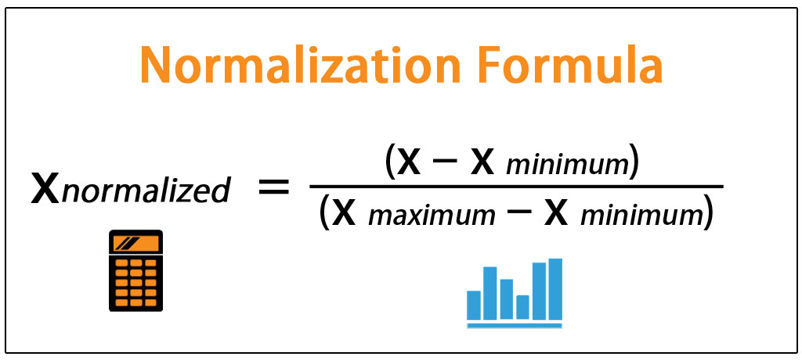
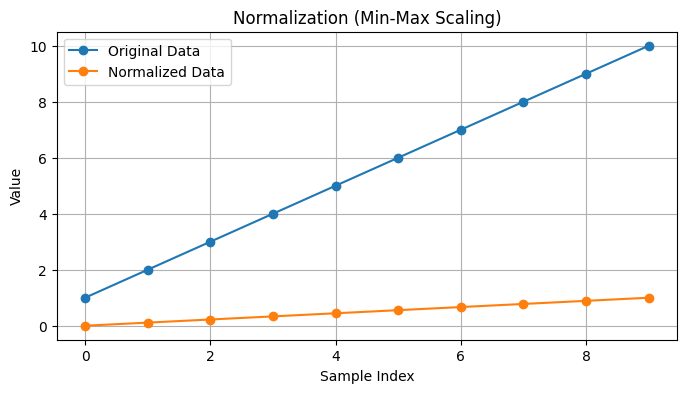
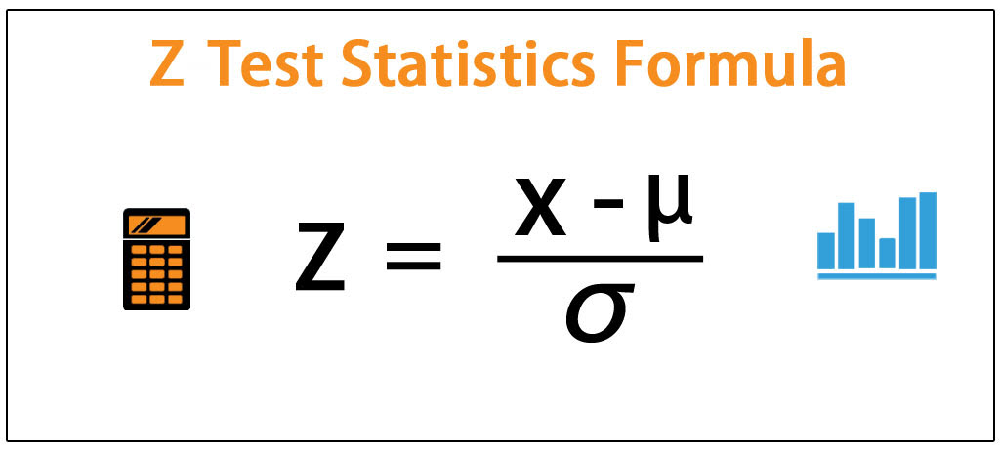
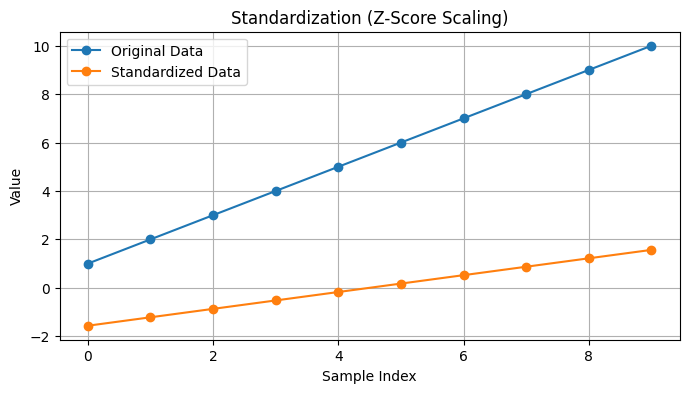

### **Feature Scaling in Sklearn**

Feature scaling is essential in machine learning when features have different ranges. Algorithms like Support Vector Machines (SVM), K-Nearest Neighbors (KNN), and Gradient Descent-based models are sensitive to the scale of data. Sklearn provides two common methods for feature scaling:

1. **Normalization (Min-Max Scaling)**: Rescales features to a fixed range, typically [0, 1].
2. **Standardization (Z-Score Scaling)**: Centers the data to have a mean of 0 and a standard deviation of 1.

---

### **1. Normalization (Min-Max Scaling)**

#### **Formula**


#### **Effect**
- Rescales the data to the range [0, 1].
- Useful for algorithms requiring bounded input, such as neural networks or distance-based algorithms.

#### **Implementation**
```python
from sklearn.preprocessing import MinMaxScaler
import numpy as np
import matplotlib.pyplot as plt

# Sample data
data = np.array([[1], [2], [3], [4], [5], [6], [7], [8], [9], [10]])

# Apply Min-Max Scaling
scaler = MinMaxScaler()
normalized_data = scaler.fit_transform(data)

# Plotting
plt.figure(figsize=(8, 4))
plt.plot(data, label='Original Data', marker='o')
plt.plot(normalized_data, label='Normalized Data', marker='o')
plt.title("Normalization (Min-Max Scaling)")
plt.xlabel("Sample Index")
plt.ylabel("Value")
plt.legend()
plt.grid()
plt.show()
```



---

### **2. Standardization (Z-Score Scaling)**

#### **Formula**


Where:
- \(\mu\) = Mean of the feature.
- \(\sigma\) = Standard deviation of the feature.

#### **Effect**
- Centers the data around 0 with a standard deviation of 1.
- Useful for algorithms assuming a Gaussian distribution (e.g., linear regression, logistic regression).

#### **Implementation**
```python
from sklearn.preprocessing import StandardScaler

# Apply Standard Scaling
scaler = StandardScaler()
standardized_data = scaler.fit_transform(data)

# Plotting
plt.figure(figsize=(8, 4))
plt.plot(data, label='Original Data', marker='o')
plt.plot(standardized_data, label='Standardized Data', marker='o')
plt.title("Standardization (Z-Score Scaling)")
plt.xlabel("Sample Index")
plt.ylabel("Value")
plt.legend()
plt.grid()
plt.show()
```

---

### **Comparison of Normalization vs. Standardization**

| Aspect                | Normalization                          | Standardization                      |
|-----------------------|----------------------------------------|--------------------------------------|
| **Range**             | [0, 1]                                | Mean = 0, Std = 1                    |
| **Sensitive to Outliers** | Yes                                  | Less sensitive                       |
| **Best for**          | Distance-based algorithms (KNN, SVM)  | Gaussian-distributed data            |

---

### **Graphs**

The plots show how the original data is transformed using both scaling methods. Below are examples of the resulting graphs:

1. **Normalization Graph**: Original values are mapped to the [0, 1] range.
2. **Standardization Graph**: Original values are transformed to have a mean of 0 and a standard deviation of 1.

---

Would you like me to generate these graphs for you?